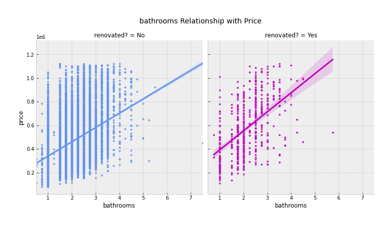
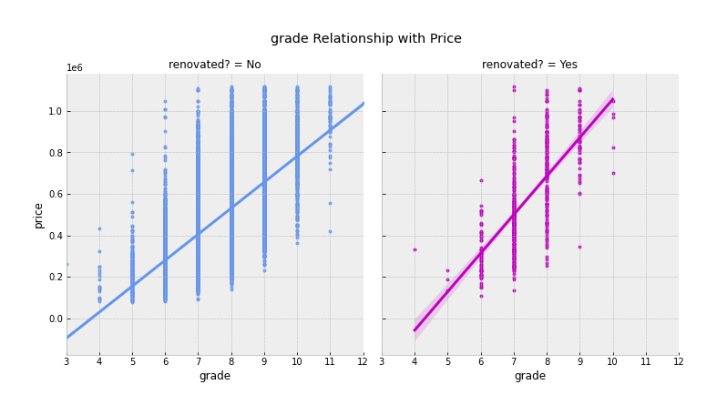

<link href="custom.css" rel="styles"></link>

# King County Housing Market

## Maximizing return on house renovation investment

Kristin Cooper | DTSC-FT-022221 | Instructor: James Irving


[Image Source](https://www.seattletimes.com/business/real-estate/king-county-home-prices-dropped-as-coronavirus-squelched-activity-but-now-the-market-may-be-picking-up/)


### Business problem:

King County, Washington, which includes the Seattle metro area, is a prime location for residential real estate investment. Homeowners and house flippers should leverage this report to understand how they can improve the resale value of their property.

## Data
### Source

Source data includes 21,597 residential houses publicly sold between May 2014 and May 2015.

### Methods

Data was preprocessed to address some missing data, remove outliers from the model training dataset, and explore the meaning and distribution of each feature. 

Some descriptive analysis confirmed that houses that were renovated do indeed tend to sell for more. Positive relationships were observed between price and the number of bedrooms, number of bathrooms, and square footage, and a negative relationship was observed between price and the years elapsed since renovation.


## Results & Recommendations

#### Zipcode Matters


> Though not in the homeowner's control, zipcode does heavily influence the median and mean house price in King County. Zipcodes near the Seattle city center and Bellevue area tend to have higher-priced homes.


#### Bathroom Count Matters More Than Bedroom Count



> The linear relationship between number of rooms and price is stronger for bathrooms than bedrooms.

#### Both Your House Size And That Of Your Neighbors Yields Higher Sale Price


> There is a strong relationship between size of living space and price - and the neighborhood house size matters too.

#### Custom Finishes, Design, & Quality Building Materials Are Worth The Investment


> Increasing your house's score on the 13-point grading system has a strong correlation with price.


### Recommendations:

Several factors were found to influence house price, some of which are probably not in the homeowner's control. Based on the model, five key recommendations for King County homeowners to consider when renovating their house are:

* **Add living space** - consider finishing an unfinished basement if you have one, or adding on to your house.
* **Add a full or half bath** - bring up your bathroom-to-bedroom ratio
* **Improve overall condition** - consider typical home maintenance projects that will improve condition rating of the house, such as repainting, updating flooring, replacing older appliances, etc.
* **Use high-quality materials** - raise your home's grade rating by bringing in marble or quartz countertops, new cabinets, crown molding, wood flooring, luxury finishes, etc.
* **Sell quickly after renovating** - newly renovated houses can sometimes feel like new. Sale price tends to be relatively higher for houses that have been renovated more recently.


### Limitations & Next Steps

Many, if not all of the features found to influence sale price have a point of diminishing returns that should be investigated further. 


## For further information
Please review the full report in [this jupyter notebook](./king_county_house_renovation_model.ipynb) or review our [presentation](./SampleProjectSlides.pdf)

For any additional questions, please contact kcoop610@gmail.com.


##### Repository Structure:

```

├── README.md            
├── report.ipynb           
├── presentation.pdf    
└── images
    └── images              
└── data
    ├── kc_house_data.csv
    ├── column_names.md
    ├── kc_zipcode_map.geojson 
    └── updated_kc_zipcode_map.json
└── styles
    └── custom.css 
 

```
